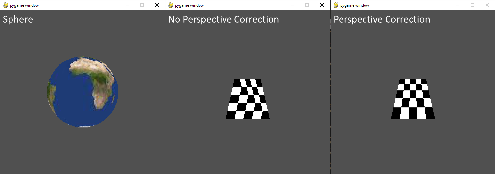
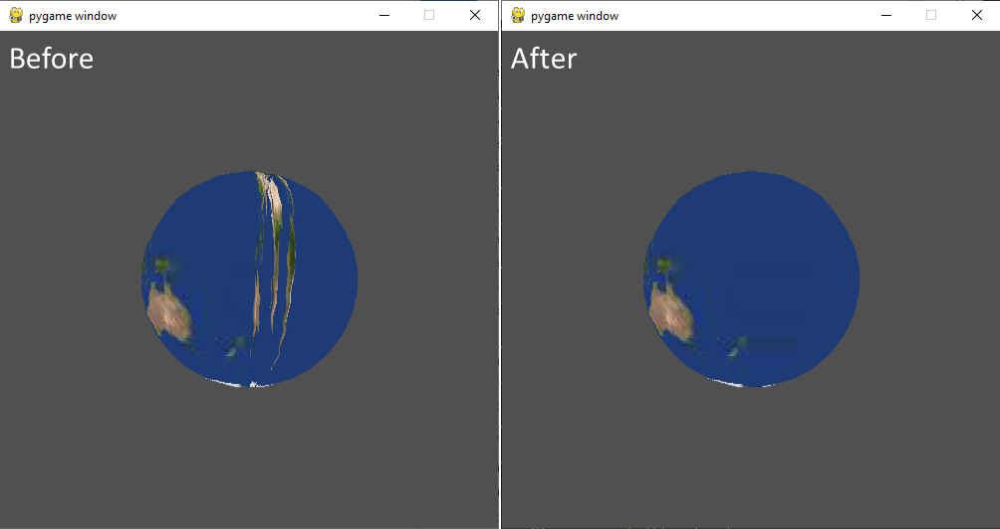

[](https://classroom.github.com/a/H1abepVY)
# Programming Assignment 8

Class: CS 4204 (Computer Graphics), Fall 2023

Professor: Brendan David-John

## Overview

In this programming assignment, you are going to complete the eigth and final step needed to render implement the fundamental components of the graphics pipeline! 
You will be extending the render loop in `Renderer` to implement texture mapping using `texture` and `texture-correct` shading. This modification requires updating the `Mesh` 
class to include a vertex-wise list of texture coordinates `uvs` and load a texture image in a `texture` variable with a new `load_texture(img_path)` function. You will modify your render loop to include `texture` and `texture-correct` modes and within them make use of the texture `uvs` to sample the image `texture` for the current mesh. You are provided with new functions for the `Mesh` class to copy into your `Mesh.py` within `provided_functions.py`. This includes `sphere_uvs()`, which fill the `uvs` list after reading in `unit_sphere.stl` based on spherical coordinates and `textured_quad()`, which is a static function that returns a populated `Mesh` object for a textured plane required for the assigment scripts. 

## Instructions
The render loop function signature will not change for this assignment. However, two new render modes will be added: 
`texture` and `texture-correct`. The methods will use the `uvs` list with barycentric interpolation to shade each fragement in each mode. The `texture-correct` mode will implement the perspective correction described in the lecture and the handout. As a reminder, you need to compute the following functions: 1/w, u/1, v/w for each vertex of the current triangle and use perspective correct interpolation to generate the `uv` coordinated to look up the RGB texture value for the current fragment. The variable w is the value used in perspective camera projection division step.

Your main tasks are to implement the `load_texture(img_path)` function in the `Mesh` class to read an input image file using the Python Imaging Library (Pillow) library for the `texture` variable. You will then update the render loop for the texture modes to index into this image using the provided `uvs` to determine the RGB value for each fragment/pixel.   

This assignment will make use of visual checks to validate your solutions.

### Output

There are a total of 3 scripts that can be executed. `extracredit.py` is what will be run to evaluate the extra 
credit. The scripts are: `assignment8_sphere`, `assignment8_perspective_correction`, and `assignment8_no_perspective_correction`.
The following image is a collage of running all of them:



### Dependency Management
Each assignment will include a requirements.txt file that includes the python package requirements for the assignment. If you are using PyCharm it should automatically detect and install the dependencies when you create the virtual environment. Otherwise, [these instructions](https://www.jetbrains.com/help/pycharm/managing-dependencies.html#configure-requirements) will help you manually manage the requirements in PyCharm. If you are using something other than PyCharm, you can use the command line to manually install the packages from the requirements.txt file:

```bash
pip install -r requirements.txt
```

**Note**: This assignment introduces a requirement for Pillow (version 8.2)

## Updates to the `Mesh` class

### Exposed Members

#### `uvs`
In order to sample a texture image, we need to track the normalized texture coordinates `u,v` for each vertex. The list is the output of the texture mapping function applied to the vertex data. The variable can be set to a default value at initialization and can be populated using the provided `sphere_uvs()` function.

#### `texture`
The texture image to be sampled using `u,v` coordinates.

### New Method

#### `load_texture(self, img_path)`
Load the image file `img_path` with `PIL.Image.open()` to populate the `texture` variable.

### New Provided Methods

#### `cart2sph(v)`
A texture mapping function using cartesian to spherical conversion to return `u,v` coordinates.

#### `sphere_uvs(self)`
Populates `uvs` coordinates using `cart2sph` texture mapping.

#### `textured_quad()`
A static function that returns a populated `Mesh` object that represents a two-triangle quad for demonstrating perspective correct texture coordinates.

## Extra Credit
Extra credit for this assignment will be to address the spherical mapping function discontinuity. This issue with the mapping function is discussed in the book, as well as frequently online. There are several ways to address this issue. For extra credit account for the discontinuity with an additional `texture-extra-credit` rendering mode and produce an output that smoothly transitions along the discontinuity of the globe texture. The extra credit will be validated by running `extracredit.py` and comparing the 
resulting rendering with the expected output below.





## Rubric
There are 10 points (11 with extra credit) for this assignment:
- *10 pts*: Texture mapping assignment8_* scripts are rendered as expected.
  - *4 pts*: `assignment8_sphere`
  - *3 pts*: `assignment8_perspective_correction`
  - *3 pts*: `assignment8_no_perspective_correction`
